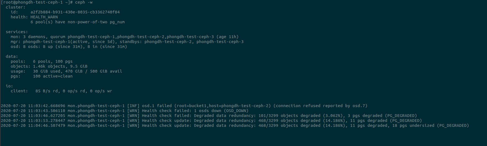

# 1. Các trạng thái của PG
- Placement Group (PG): CEPH sẽ nhóm các object vào PG để quản lý. Tuỳ theo số bản replicate mà PG sẽ phân bổ vào 2 hoặc 3 OSD khác nhau

    

- Creating: Khi tạo 1 pool, Ceph sẽ tạo ra PG theo số PG đã chỉ định.

- Peering: Để CEPH có thể xác định trạng thái của PG, các OSD(2 hoặc 3 tùy vào replicate) sẽ thực hiện thỏa thuận về trạng thái của object và metadata trong PG. Khi CEPH hoàn thành peering, có nghĩa là các OSD đều đồng ý về trạng thái hiện tại của PG.

    

- Active: sau khi thực hiện thành công quá trình peering, PG có thể có trạng thái active. Các data trên các PG đã ở trạng thái sẵn sàng và thực hiện thành công việc replicate.

- Clean: Khi trạng thái PG là clean, các OSD là thỏa thuận thành công(peering). Ceph đã replicate tất cả các objects trong PG số lần chính xác

- Degraded: khi một OSD bị down, trong quá trình chờ trạng thái OSD trở về up , PG sẽ đi vào trạng thái Degraded. Nếu sau 600s, OSD không trở về trạng thái up, CEPH sẽ thực hiện khôi phục PG sang một OSD , đảm bảo số replicate, sau khi thỏa thuận (peering) thành công, PG trở về trạng thái bình thường(active+clean)

- Recovering: khi một OSD có trạng thái down sau 600s, quá trình Degraded sẽ được chuyển về Recovering, sẽ thực hiện replicate tới các OSD khác. Có thể chỉnh độ ưu tiên: `ceph osd pool set {pool-name} recovery_priority {value}`

    - forced_recovery: thực hiện recovery có độ ưu tiên cao, được thực hiện bởi người dùng: `ceph pg force-recovery {pg-id}`
    - recovery_wait: PG đang chờ để được recovery
    - recovery_toofull: PG đang chờ để được recovering vì OSD đích đến của PG đang bị quá tải(đang write,read hoặc backfill)  => chỉnh độ ưu tiên cho quá trình recovering cao vì việc phục hồi dữ liệu là quan trọng.
    - recovery_unfound: 

- Backfilling:  khi một OSD mới dược thêm vào cụm, CEPH sẽ cố gắng thực hiện cân bằng tải lại hệ thống bằng cash di chuyển một số PG sang OSD mới.
    
    - forced_backfill: thực hiện backfill có độ ưu tiên cao, được thực hiện bởi người dùng: `ceph pg force-backfill {pg-id}`
    - backfill_wait: PG đang chờ để thực hiện backfill
    - backfill_toofull: PG đang chờ để được backfill vì OSD đích đến của PG đang bị quá tải(đang write,read hoặc recover) => chỉnh độ ưu tiên cho quá trình backfill thấp vì không ảnh hưởng nhiều đến dữ liệu.
    - backfill_unfound: 

- Remapped: quá trình thực hiện di chuyển PG từ OSD cũ sang OSD mới, PG sẽ được chuyển vào trạng thái remappled

- Stale: trạng thái của PG ko được update, có thể do các OSD chứa PG này đều down. (thử down osd1 và osd4, replicate 2)

    

    

- scrubbing: CEPH sẽ kiểm tra metadata của PG theo định kỳ để xem có giống nhau trên các bản replicate không

- deep: CEPH sẽ kiểm tra checksum của PG theo định kỳ để xem có giống nhau trên các bản replicate không => lâu hơn scrubbing

- Inconsistent: khi các PG trong quá trình replicate không đảm bảo tính toàn vẹn, PG sẽ có trạng thái Inconsistent

- Repair: Ceph sẽ kiểm tra các PG và sẽ sửa các PG có trạng thái Inconsistent nếu có thể

- Undersized: Số lượng host để replicate ít hơn size replicate của pools

- Incompleted: PG có trạng thái incompleted nếu CEPH phát hiện PG thiếu thông tin hoặc có 1 bản replicate không hoàn chỉnh ở trên OSD khác

- premerge: trạng thái xảy ra khi gộp các PG lại (thay đổi số PG nhỏ hơn số PG ban đầu)

# 2. Các trường hợp xảy ra

- TH1: Số lượng host để replicate ít hơn size replicate của pools

    - 

- TH2: Thay đổi số PG nhỏ hơn số PG ban đầu

    - 

- TH3: OSD bị down

    - Khi 1 OSD mới bị down sẽ xuất hiện trạng thái Degraded

        - 

        - 

    - Sau 600s sẽ xuất hiện các trạng thái: 

        

        

- TH4: Thêm mới OSD

    