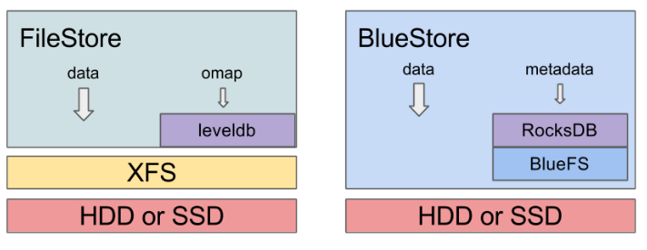

# 1.Filestore và BlueStore
- FileStore: cần file system trên disk

    - Sử dụng journal để đảm bảo tính nhất quán
    - FileStore phải ghi 2 lần, đầu tiên sẽ ghi vào journal sau đó mới ghi vào disk

- BlueStore không yêu cầu file system trên các  vì BlueStore đẩy các object trực tiếp lên disk

    - Quản lý bằng RocksDB
    - RocksDB sử dụng BlueFS

# 2. Các chức năng chính của BlueStore

- Quản lý trực tiếp: BlueStore sử dụng raw trên disk, tránh can thiệp vào các layer, ví dụ như filesystem XFS có thể giới hạn hiệu năng và thêm độ phức tạp

- Quản lý metada bằng RocksDB: BlueStore sử dụng cơ sở dữ liệu key-value để quản lý metadata, ví dụ như map object tới vị trí trên ổ đĩa

- Dữ liệu và metadata được kiểm tra: Tất cả data và metadata đều được kiểm tra. Không có data hoặc metadata nào trả lại cho người dùng mà ko được xác minh.

- Copy-on-write: Sử dụng copy-on-write khi copy hoặc dùng snapshot

- Không write 2 lần: BlueStore sẽ ghi new data tới vùng chưa được phân bổ, sau đó RocksDB sẽ cập nhật metadata của object tới disk

- Hỗ trợ nhiều thiết bị: BlueStore có thể sử dụng nhiều thiết bị để lưu trữ dữ liệu khác nhau