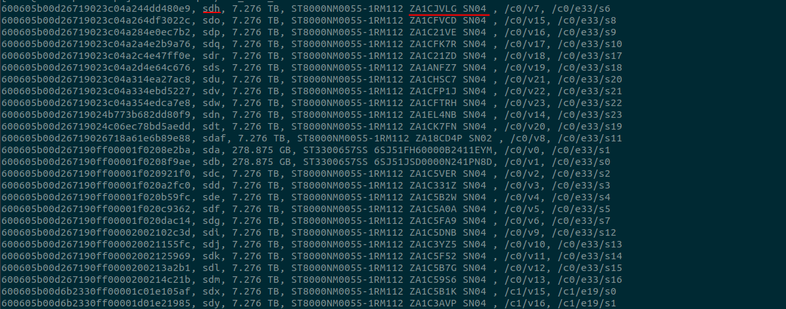
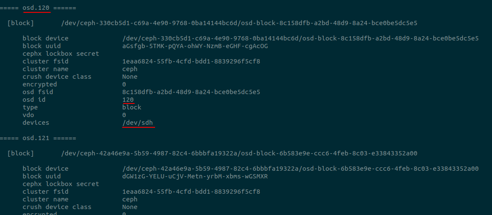

- Tìm disk lỗi (trong trường hợp chỉ 1 disk lỗi): 

    - cd `/opt`
    - chạy script: `bash scripts/all_info_disk.sh`, so sánh Serial với serial bị lỗi => /dev/sdh

        

    - Chạy lệnh `ceph-volume lvm list` để tìm /dev/sdh thuộc osd nào

        

    - export i=120 để chạy lệnh dưới với i = osd cần r
    - `ceph osd out ${i};ceph osd crush remove osd.${i};systemctl stop ceph-osd@${i};sleep 5;umount /var/lib/ceph/osd/ceph-${i};ceph auth del osd.${i};ceph osd rm ${i}`

    - Ghi note lỗi lên sheet

    

