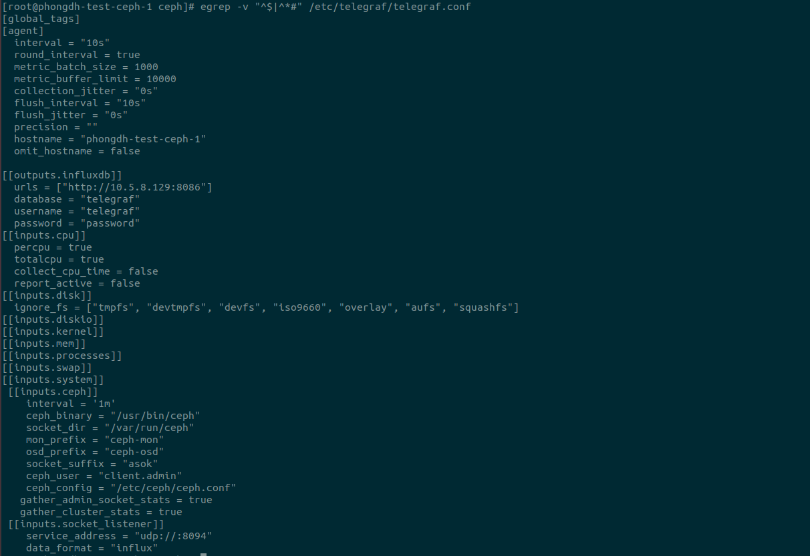
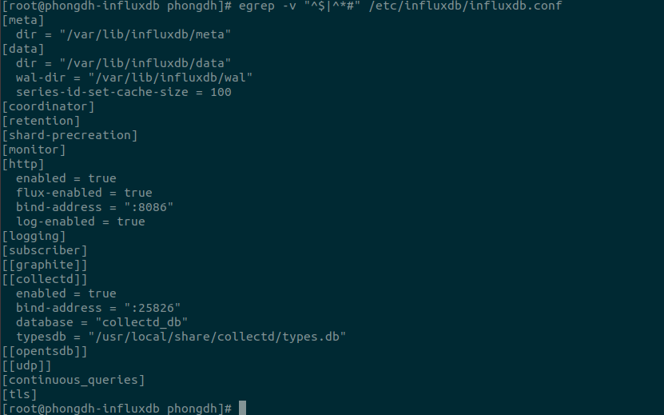
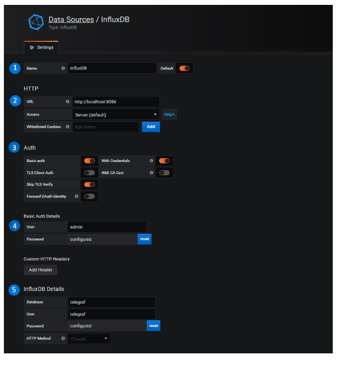

# Monitor ceph với telegraf, influx và grafana

- Lên `https://www.influxdata.com/` down Telegraf trên node cần lấy metrics `phongdh-test-ceph-1`
- Down và cài đặt influxDB và grafana trên cùng 1 server: `phongdh-influxdb`

## 1. config trên node ceph

- Cài đặt telegraf
- Sửa file `/etc/telegraf/telegraf.conf`

    
- Config module telegraf:

    - enable module telegraf: `ceph mgr module enable telegraf`
    - `ceph telegraf config-set address udp://:8094`
    - `ceph telegraf config-set interval 10`

- Config module influxdb:

    - Nếu enable bị lỗi:

            rpm -e --nodeps  python-requests
            yum -e python-requests
            pip install influxdb
            yum  python-requests
            yum install python-requests
            systemctl restart ceph-mgr@`hostname`
            ceph mgr module enable influx

    - enable module: `ceph mgr module enable influx`
    - ceph config set mgr mgr/influx/hostname phongdh-influxdb (hostname influxdb)
    - ceph config set mgr mgr/influx/username telegraf (uername influx)
    - ceph config set mgr mgr/influx/password password (pass database)
    - ceph influx config-set database telegraf (chọn tên database)

- Config quyền để cho telegraf có thể đọc được `/var/run/ceph` và key `ceph.client.admin.keyring` (chmod 777 hoặc chown telegraf)

- Restart telegraf : `systemctl restart telegraf` 

- Test xem telegraf đã dùng được ceph chưa: `sudo -u telegraf ceph --cluster ceph status`

## 2. Config trên node influxdb

- Sửa file cấu hình `/etc/influxdb/influxdb.conf`

    

- Sử dụng influxdb:

    - Nhập lệnh `influx` để sử dụng giống MYSQL
    - Tạo database: `create database telegraf`
    - Tạo user cho telegraf với pass là password: `create user telegraf with password 'password' with all privileges`
    - Kiểm tra: `show databases` và `show users`

## 3. Cài đặt grafana

- Lên trang chủ down và install

- Link sử dụng : `IP:3000`

- Tên đăng nhập và mật khẩu mặc định khi mới cài: `admin/admin`

- Thêm influxDB server ở trên làm nguồn dữ liệu để vẽ đồ thị

    - Trên giao diện, ta chọn Configuration -> Data Sources -> Add data source

    - Chọn influxdb

    - Điền thông tin database:

        

        - 1 : Tên InfluxDB
        - 2 : Đường dẫn truy cập InfluxDB. Tại đây, ta cài cùng trên 1 server nên là localhost
        - 3 : Xác thực
        - 4 : Tài khoản xác thực. Nhập tài khoản admin của InfluxDB và mật khẩu
        - 5 : Database sẽ lấy. Ta dùng telegraf. User và password của telefraf

- Sau đó lên grafana tìm dashboard phù hợp và sử dụng

