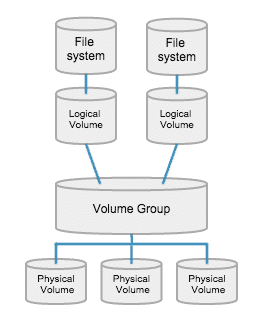
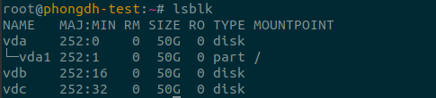
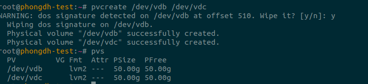
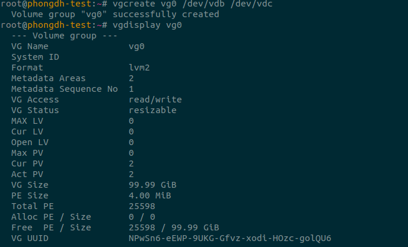
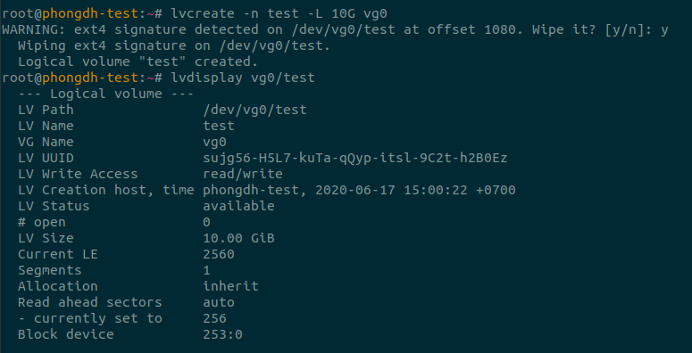
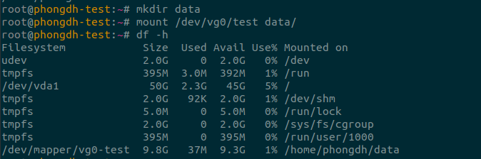
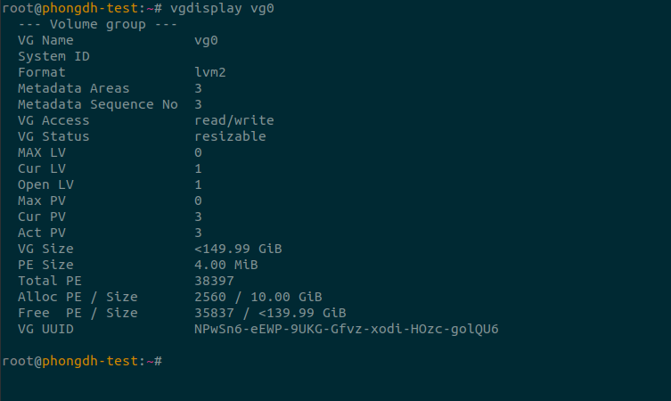
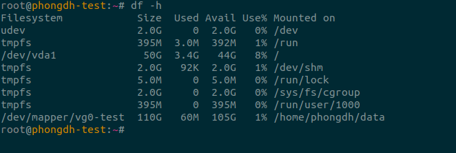
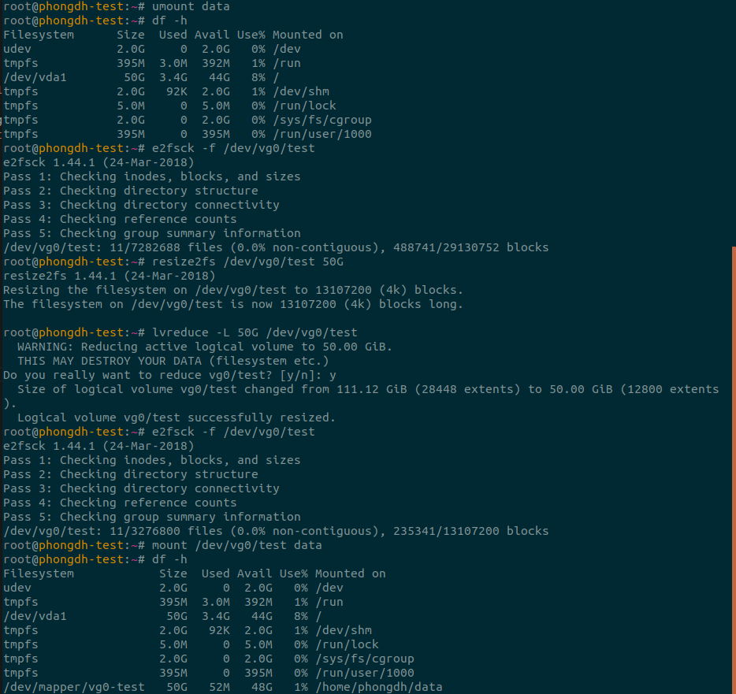

# 1. LVM là gì
- LVM là một công cụ để quản lý phân vùng logic được tạo và phân bổ từ các ổ đĩa vật lý. LVM có thể dễ dàng tạo mới, thay đổi kích thước hoặc xóa bỏ phân vùng đã tạo.
- Quản lý nhiều đĩa cứng lớn bằng cách cho phép thêm và thay thế đĩa mà không bị ngừng hoạt động hoặc gián đoạn dịch vụ
- LVM cho phép các hệ thống tệp dễ dàng thay đổi kích thước khi cần

# 2. Các thành phần trong LVM

- Physical Volume: Ổ cứng vật lý (đĩa cứng, partition, SSD…) có thể chia thành nhiều phân vùng vật lý
- Volume Group: Là một nhóm bao gồm các Physical Volume trên 1 hoặc nhiều ổ đĩa khác nhau được kết hợp lại thành một Volume Group
- Logical volume: Một Volume Group được chia nhỏ thành nhiều Logical Volume. Nó được dùng cho các để mount tới hệ thống tập tin (File System) và được format với những chuẩn định dạng khác nhau như ext2, ext3, ext4…

- =>> LVM có thể được sử dụng để kết hợp các Physical Volume thành các Volume Group để thống nhất không gian lưu trữ có sẵn trên một hệ thống. Sau đó, ta có thể phân Volume Group thành các Logical Volume tùy ý, hoạt động như các phân vùng.

# 3.Tạo LVM

## 3.1 Tạo Physical Volume
- Kiểm tra các disk đang có trên server, dùng lệnh `lsblk`

- Chạy lệnh sau để tạo physical volume(PV) trên `/dev/vdb` và `/dev/vdc`:

    `pvcreate /dev/vdb /dev/vdc`

- Kiểm tra các PV vừa tạo, dùng lệnh `pvs`

- Xem thông tin chi tiết PV /dev/vdb ta dùng lệnh: `pvdisplay /dev/vdb`

## 3.2 Tạo Volume Group
- Để tạo volume group với tên `vg0` bằng cách sử dụng `/dev/sdb` và `/dev/sdc`, dùng lệnh: `vgcreate vg0 /dev/vdb /dev/vdc`

- Kiểm tra các VG có trong server, chạy lệnh: `vgs`

- Xem thông tin `vg0` vừa tạo, chạy lệnh: `vgdisplay vg0`

    

- Vì vg0 có 2 ổ vdb và vdc, mỗi ổ có dung lượng 50GB nên dung lượng của vg0 là 99.99GB

## 3.3 Tạo Logical Volume

- Tạo 1 LV từ vg0 có tên test_lv với dung lượng 10GB: `lvcreate -n test -L 10G vg0`
- Để xem thông tin LV vừa tạo: `lvdisplay vg0/test`

    

- Tạo file system ext4 cho LV test: `mkfs.ext4 /dev/vg0/test`
- Tạo thư mục data và mount vào để sử dụng, có thể sửa file `/etc/fstab` để nhận khi reboot server

    

# 4. Thay đổi kích thước
## 4.1 Mở rộng VG
- Sử dụng lệnh `vgextend vg0 /dev/vdd`

    

- Size vg0 đã tăng lên 149.99GB

## 4.2 Tăng kích thước LV

- Để tăng kích thước cho /dev/vg0/test, chạy lệnh: `lvextend -L +100GB /dev/vg0/test`
- Sau khi chạy lệnh trên chúng ta cần thay đổi kích thước hệ thống tệp, vì thế chúng ta phải chạy lệnh sau để resize `resize2fs /dev/vg0/test`
- Kiểm tra: `df -h`

    

## 4.3 Giảm kích thước LV
- Để giảm LV, cần phải sao lưu dữ liệu đề phòng sự cố xảy ra

- B1: Unmount: `umount data`
- B2: Kiểm tra file system `e2fsck -f /dev/vg0/test`
- B3: Giảm kích thước LV xuống 50G: 
    - `resize2fs /dev/vg0/test 50G`
    - `lvreduce -L 50G /dev/vg0/test`
- B4: Kiểm tra lại file system: `e2fsck -f /dev/vg0/test`
- B5: mount lại thư mục: `mount /dev/vg0/test data`
- B6: Kiểm tra

    

