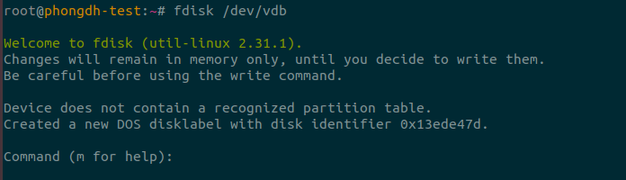
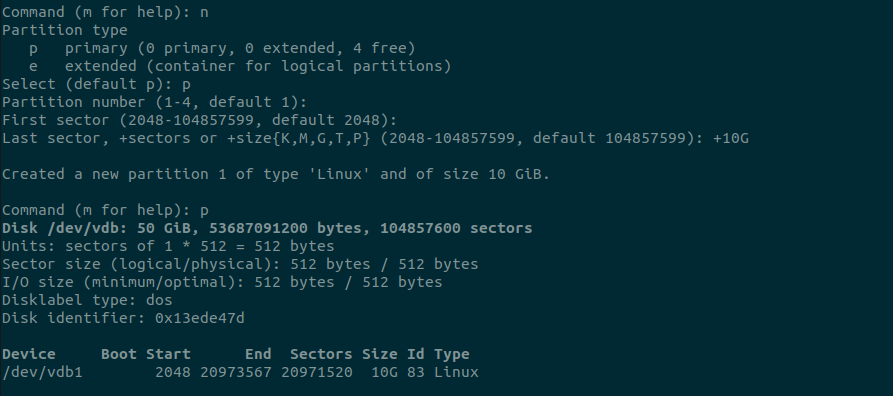

# Phân vùng ổ cứng
- B1: Kiểm tra số lượng ổ cứng, dùng lệnh : `lsblk`

    

- B2: Muốn chia phân vùng ổ vdb ta dùng lệnh `fdisk /dev/vdb`

    

    - Chọn phím `m` để xem trợ giúp

        

    - Chọn phím `n` để tạo phân vùng mới

        

    - Chọn phím p để tạo phân vùng primary
    - Chọn thứ tự phân vùng (không bấm gì là default)
    - Chọn sector đầu tiên (không bấm gì là default)
    - Chọn sector cuối cùng (không bấm gì là default, hoặc muốn chọn 10G thì `+10GB`
    - Chọn `p` để in ra các phân vùng có trong `/dev/vdb`

        
    - Chọn `w` để lưu các thao tác vừa xong hoặc `q` để thoát không lưu

- B3: Tạo file system: dùng lệnh `mkfs.ext4 /dev/vdb1` để tạo file system ext4 cho phân vùng 1 của `/dev/vdb`
    
    - Dùng lênh `lsblk -f`kiểm tra các ổ đĩa và loại file system

        

- B4: tạo thư mục để mount hoặc sửa trong file `/etc/fstab` để sử dụng

    
