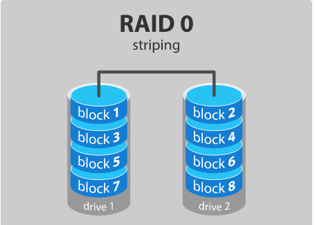
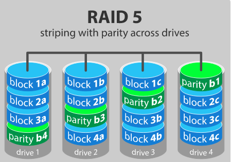
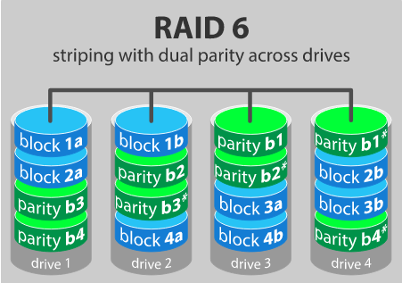
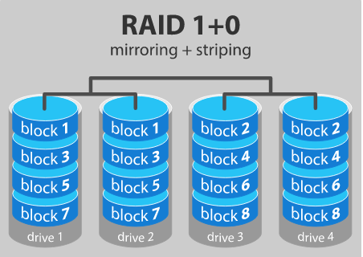

# 1.Giới thiệu về RAID
- RAID là từ viết tắt của cụm từ "Redundant Array of Inexpensive Disks" hoặc "Redundant Arrays of Independent Disks", là hình thức ghép nhiều ổ đĩa vật lý lại với nhau nhằm chịu lỗi và tăng tốc.
- RAID là một tập hợp các disk trong một nhóm để trở thành một logical volume. Chỉ có một cấp độ RAID có thể được áp dụng trong một nhóm các disk.
- Theo cấp độ RAID đã chọn của chúng ta, hiệu suất và khả năng chịu lỗi sẽ khác nhau.
# 2.Các cấp độ của RAID

## 2.1 RAID 0 - striping

- RAID 0 cần ít nhất 2 disk.
- Trong RAID 0, dữ liệu sẽ được ghi vào đĩa bằng phương pháp chia sẻ, một nửa nội dung sẽ nằm trong một đĩa và một nửa khác sẽ được ghi vào đĩa khác. Vì sử dụng nhiều ổ đĩa cùng 1 lúc nên nó mang lại hiệu năng I/O vượt trội.

- Ưu điểm:

    - Cung cấp hiệu năng tốt.
    - Tất cả dung lượng của disk được sử dụng.
    - Chi phí thấp, dễ thực hiện.

- Nhược điểm

    - Không có khả năng chịu lỗi, nếu 1 disk bị lỗi, tất cả dữ liệu trong RAID 0 sẽ mất => không nên sử dụng trong hệ thống quan trọng

## 2.2 RAID 1 - mirroring

- RAID 1 cần ít nhất 2 disk.
- Dữ liệu sẽ được lưu trữ ở tất cả các disk
- Nếu 1 ổ đĩa bị lỗi, ổ đĩa thứ 2 có thể đọc ghi dữ liệu mà không bị ảnh hưởng
- Ưu điểm:

    - Tốc độ đọc tốt và tốc độ ghi tương đương tốc độ 1 ổ đĩa
    - Khi 1 ổ đĩa bị lỗi, dữ liệu không cần phải xây lại mà chỉ cần sao chép từ ổ đĩa không bị lỗi.

- Nhược điểm:

    - Dung lượng chỉ bằng 1/2 dung lượng tổng các ổ đĩa.

## 2.3 RAID 5 - striping with parity

- RAID 5 cần ít nhất 3 ổ đĩa.
- RAID 5 sử dụng phương pháp parity để duy trì dự phòng dữ liệu.
- Dữ liệu không được ghi vào 1 ổ đĩa cố định, chúng được trải rộng trên tất cả các ổ đĩa.
- Giả sử có 1 file A thì khi lưu trữ sẽ tách ra 3 phần 1a, 1b, 1c. Ba phần nãy sẽ tương ứng lưu trên ổ đĩa (drive 1,2,3) còn ổ đĩa drive 4 sẽ giữ bản sao lưu(parity b1) của 3 phần này.
- Ưu điểm:

    - Tốc độ đọc dữ liệu nhanh
    - Nếu một ổ đĩa lỗi hoặc đang được thay thế, vẫn có thể truy cập vào tất cả dữ liệu
    - Có thể xây dựng lại dữ l

- Nhược điểm:

    - Chỉ có thể chịu lỗi được 1 ổ đĩa trong 1 thời điểm.
    - Không sử dụng hết dung lượng tất cả các ổ đĩa. VD: nếu có n ổ đĩa 1TB, dung lượng tối đa có thể lưu trữ là (n-1) x 1TB

## 2.4 RAID 6 - striping with double parity

- Cần tối thiểu 4 ổ đĩa
- Tương tự như RAID 5, nhưng RAID 6 sử dụng 2 ổ đĩa parity => khả năng chịu lỗi được 2 ổ đĩa trong cùng 1 thời 

## 2.5 RAID 10 - combining mirroring and striping

- RAID 10 là kết hợp của RAID 1 và RAID 0

- Ưu điểm:

    - Hiệu suất đọc và viết tốt
    - Xây dựng lại nhanh chóng từ sao chép dữ liệu
 
- Nhược điểm:

    - Chỉ sử dụng được 1/2 dung lượng tất cả ổ đĩa

