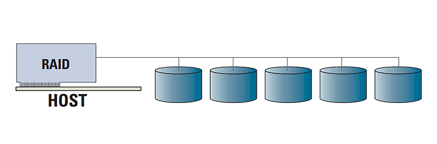

# RAID cứng
- RAID cứng có bộ xử lý và bộ nhớ riêng để chạy ứng dụng RAID. Hệ thống RAID là một hệ thống máy tính con độc lập chỉ dành cho RAID, giảm tải khỏi host.

    

# 1. Card raid
- Đây là card mở rộng thường tích hợp một bộ xử lý RAID và có giao tiếp riêng với ổ đĩa.
- Nó thường được cắm vào khe PCI-X hoặc PCIe trên bo mạch chủ hệ thống máy tính. Những card plug-in này thường có giá đắt nhất, nhưng cũng là giải pháp RAID linh hoạt nhất và hiệu năng tốt nhất. Ở đây, chức năng RAID hoàn toàn độc lập với host.
- Card RAID giúp giảm tải hoàn toàn tác vụ tạo ra một hệ thống lưu trữ dự phòng từ hệ thống máy tính và không ảnh hưởng đến hiệu năng của toàn hệ thống, ngay cả trong trường hợp hỏng ổ đĩa. Những cấp độ RAID phức tạp và hiệu quả dung lượng hơn (như RAID 5 hoặc RAID 6) có thể được dùng mà không ảnh hưởng gì đến hệ thống.

- Những lợi ích và hạn chế:

    - Được bảo vệ khi boot: Dữ liệu không bị ảnh hưởng gì khi ổ đĩa boot bị lỗi hoặc hỏng hoàn toàn
    - Hiệu năng tải làm việc độc lập trên máy chủ: Bộ nhớ nhanh, bộ xử lý nhanh và không ảnh hưởng đến hiệu năng của các ứng dụng đang chạy trên hệ thống host
    - Ứng dụng RAID độc lập với host: Không gặp vấn đề về tính toàn vẹn dữ liệu khi hư hỏng hệ thống.
    - Nâng cao khả năng bảo vệ trong trường hợp mất nguồn: Các giải pháp RAID cứng thường thực thi tiến trình ghi trên phần cứng bất biến. Các giải pháp RAID mềm thiếu đi sự bảo vệ này, khiến nó khó phục hồi khi bị mất nguồn trong quá trình ghi.
    - Không dễ bị nhiễm vi rút: Mảng RAID hoàn toàn độc lập với hệ thống host và HĐH. Không xảy ra vấn đề về tính toàn vẹn dữ liệu khi sự cố hệ thống.
    -  Giảm tải tác vụ RAID khỏi host: Phù hợp nhất với loại RAID 5 hoặc RAID 6, thường cho tỷ lệ chi phí / hiệu năng tốt nhất.
    - Có GUI và phần mềm riêng: Dễ dàng thiết lập và bảo dưỡng mảng RAID.
    - Dễ di chuyển và thay thế: Card có thể được cắm vào bất kỳ hệ thống nào và dễ thay thế hoặc nâng cấp bằng biến thể mới nhất, tốt nhất. Cũng dễ dàng hơn trong việc di chuyển từ một HĐH này sang HĐH khác.
    - Hỗ trợ các tính năng RAID nâng cao: Điển hình như cắm nóng ổ đĩa (hot plug), di chuyển toàn mảng và mở rộng dung lượng trực tuyến
    - Bộ nhớ cache trên bộ điều khiển: Tăng tốc độ truy cập bằng cách sử dụng bộ nhớ cache, bao gồm khả năng sử dụng cache write-back nếu bộ nhớ được bảo vệ bằng pin
    -  Chi phí cao nhất: Bộ xử lý Vào/Ra và bộ nhớ bổ sung trên card plug-in làm tăng thêm chi phí.

